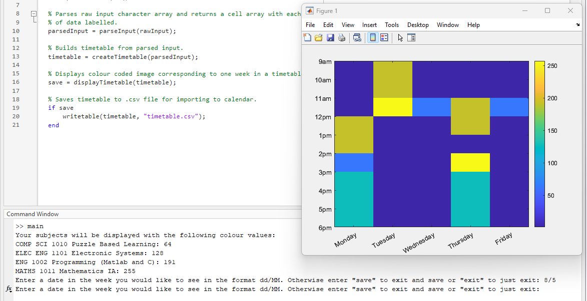

# adelaide-uni-timetable-exporter
A MATLAB tool to export University of Adelaide timetables to Google Calendar.

Instructions:
1. Navigate to 'Class Times' page on Access Adelaide under enrollments.
2. Copy table excluding header row.
3. Run main.m and paste the table.
4. Follow instructions in MATLAB.

